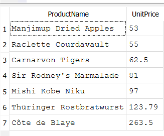

# Checkpoint 1 — Basic SELECT / WHERE / ORDER BY / LIMIT

### Query 1: Which products cost more than $50, cheapest first?
```sql
SELECT ProductName, UnitPrice
FROM Products
WHERE UnitPrice > 50
ORDER BY UnitPrice ASC;
```


---

### Query 2: Who are the 10 customers based in Germany?
```sql
SELECT CompanyName, City, Country
FROM Customers
WHERE Country = 'Germany'
LIMIT 10;
```


### 3. What are the 5 most expensive products currently in stock (not discontinued)?
```sql
SELECT ProductName, UnitPrice, UnitsInStock
FROM Products
WHERE Discontinued = 0
ORDER BY UnitPrice DESC
LIMIT 5;
```


### 4. Which orders were shipped to France after Jan 1, 1997?
```sql
SELECT OrderID, CustomerID, ShipCountry, OrderDate
FROM Orders
WHERE ShipCountry = 'France' AND OrderDate > '1997-01-01'
ORDER BY OrderDate;
```


### 5. Which employees were born before 1994? Who is the oldest employee?
```sql
SELECT FirstName, LastName, BirthDate
FROM Employees
WHERE BirthDate < '1994-01-01'
ORDER BY BirthDate ASC;
```


