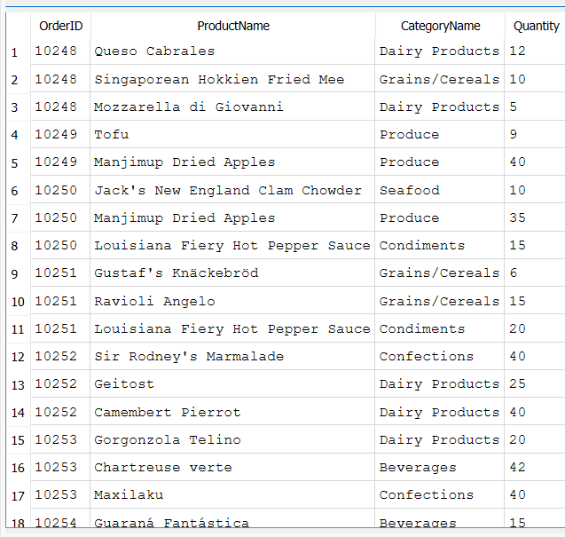
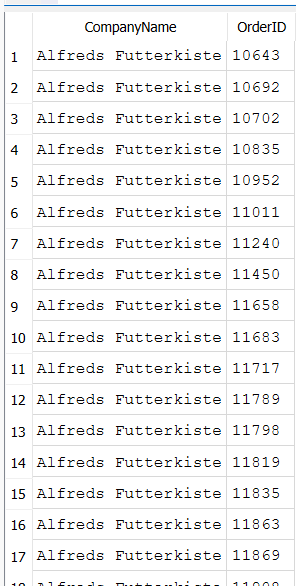
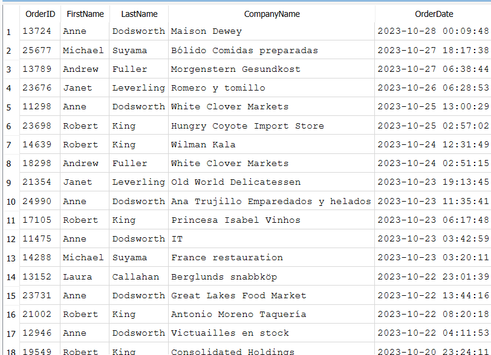

### Find which products are bought in each order. (INNER JOIN)
```sql
SELECT o.OrderID, p.ProductName, c.CategoryName, q.Quantity -- here o, p, c and q are aliases for Orders, Products, etc.
FROM Orders o -- o alias for Orders table
INNER JOIN "Order Details" q ON o.OrderID = q.OrderID -- q is alias for "Order Details" table. I used double quotes because normally sql does not parse spaces in table names.
INNER JOIN Products p ON q.ProductID = p.ProductID -- Joins table Order Details and table Products with their mutual column ProductID.
INNER JOIN Categories c ON p.CategoryID = c.CategoryID
ORDER BY o.OrderID
LIMIT 20;
```


--- 

### Show 20 customers and the company they bought from. (LEFT JOIN)
```sql
SELECT c.CompanyName, o.OrderID
FROM Customers c
LEFT JOIN Orders o ON c.CustomerID = o.CustomerID
LIMIT 20;
```


---

### Find which employee handled which order for which customer (INNER JOIN)
```sql
SELECT o.OrderID, e.FirstName, e.LastName, c.CompanyName, o.OrderDate
FROM Orders o
INNER JOIN Employees e ON o.EmployeeID = e.EmployeeID
INNER JOIN Customers c ON o.CustomerID = c.CustomerID
ORDER BY o.OrderDate DESC
LIMIT 20;
```


---
