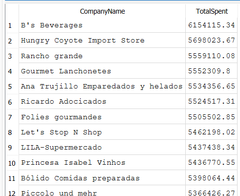

###  We will find which customers spent more than the average customer?
```sql
-- find customers who spent MORE than the average customer's total spend.
-- We have to first calculate each customer's total spend. Then find the AVERAGE of those totals, THEN  compare each customer to it

SELECT c.CompanyName,
       ROUND(SUM(od.UnitPrice * od.Quantity * (1 - od.Discount)), 2) AS TotalSpent
FROM Customers c
INNER JOIN Orders o ON c.CustomerID = o.CustomerID
INNER JOIN "Order Details" od ON o.OrderID = od.OrderID
GROUP BY c.CustomerID
HAVING TotalSpent > (
    -- Subquery here calculates average of all customers' individual totals.
    SELECT AVG(CustomerTotal) FROM (
        -- This subquery findsthe total spend per customer.
        SELECT SUM(od2.UnitPrice * od2.Quantity * (1 - od2.Discount)) AS CustomerTotal
        FROM Orders o2
        INNER JOIN "Order Details" od2 ON o2.OrderID = od2.OrderID
        GROUP BY o2.CustomerID
    )
)
ORDER BY TotalSpent DESC;
```

