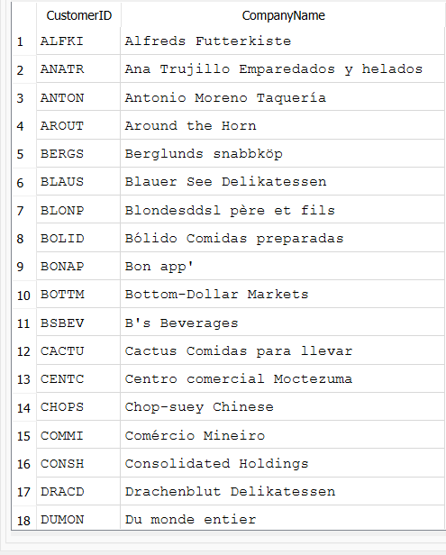
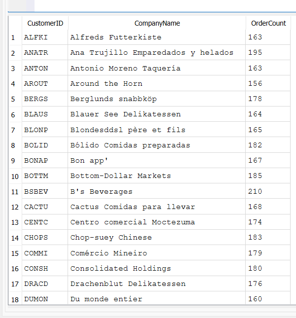

### What does an index do?
An index sorts data by alphebet or numbers. When a query searches for something in the data, it must look through every data until it finds the desired one.
For example, a user named Aygul created an account a year ago but in the system the user created an accoutn yesterday is on the top. So when we
search for Aygul's data, the system will look through every user (say 500 users) until it finds Aygul.
However, when the data is indexed, the system creates a hidden lookup table and every user in the table has a pointer. When Aygul is searched,  the system uses Aygul's pointer and finds her data much faster.
In short, indexing is faster and less 'tiring' for the system.

### Turning a correlated subquery into a JOIN
A correlated subquery re-runs once per outer row, which is slow. For example:

**Before:**
```sql
SELECT CustomerID, CompanyName
FROM Customers c
WHERE (SELECT COUNT(*) FROM Orders o WHERE o.CustomerID = c.CustomerID) > 5;
```
This is corrolated and slow.




**After:**
```sql
SELECT c.CustomerID, c.CompanyName, COUNT(o.OrderID) AS OrderCount
FROM Customers c
INNER JOIN Orders o ON c.CustomerID = o.CustomerID
GROUP BY c.CustomerID
HAVING COUNT(o.OrderID) > 5;
```
This one is faster. The JOIN version runs once and groups the results, instead of re-querying .
It orders separately for every single customer whichis faster on large tables.

