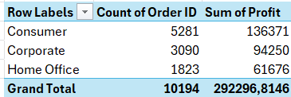
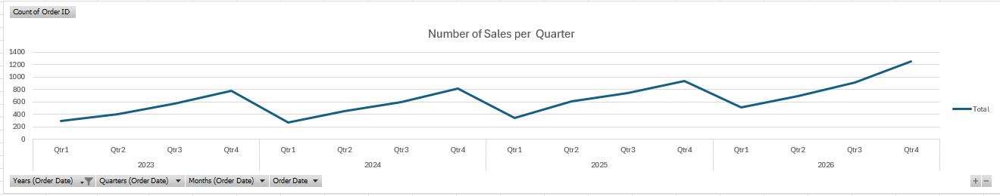

## Which segment purchased the most, and how much did the company earn from each?

| Segment | Order Count | Profit Earned |
|---|---|---|
| Consumer | 5,281 | $136,371 |
| Corporate | 3,090 | $94,250 |
| Home Office | 1,823 | $61,676 |

**Consumer** is by far the largest segment, both in order volume and total profit earned — accounting for more orders than Corporate and Home Office combined.

## Order Trends Per Year

Each Q1 shows the lowest sales of the year, followed by a steady climb that peaks in Q4. This pattern repeats every year and reflects normal retail seasonality:

- **Q4 peaks**: holiday shopping and year-end corporate/office purchases drive sales up.
- **Q1 dips**: customers recover from holiday spending, and annual price changes typically take effect at the start of the year, causing a temporary pause in purchasing before demand picks back up as prices settle.

Beyond the seasonal cycle, order volume is trending upward year over year (2,051 → 2,130 → 2,634 → 3,379+), showing consistent business growth underneath the seasonal pattern.
