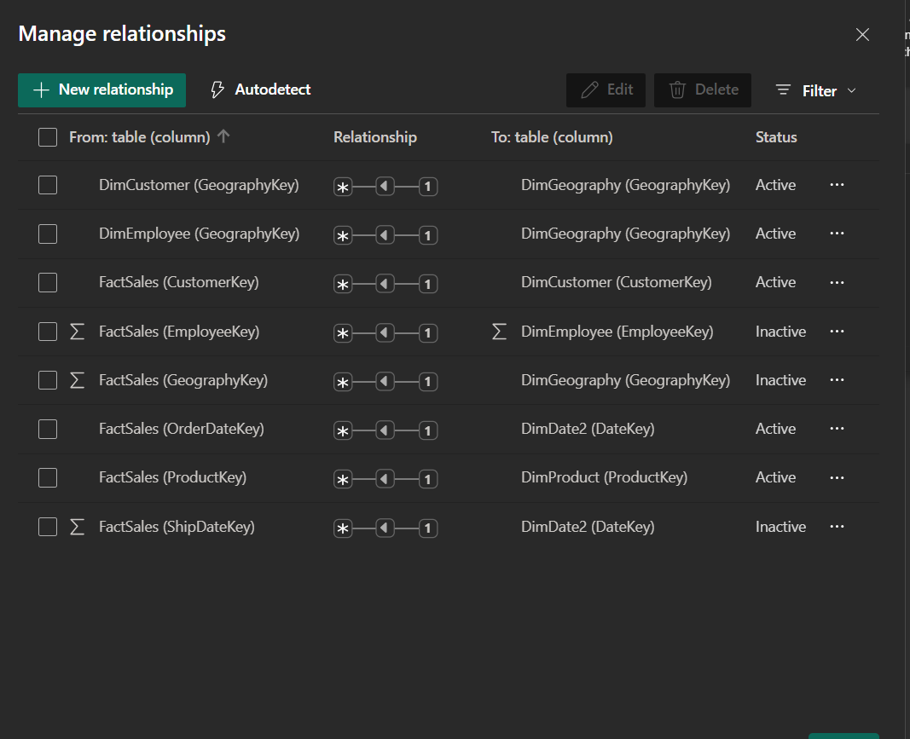
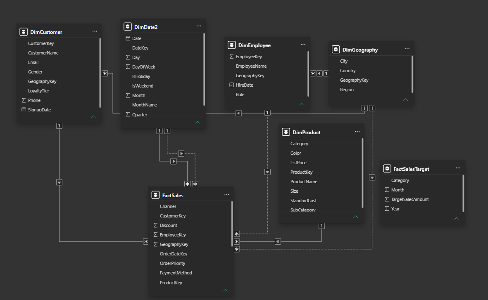

## Data Import + Master Data Modeling

I imported the CSV files into Power BI. After checking the data types via Power Query, I reviewed the model and relationships that were created automatically.
There were missing relationships, such as between `FactSales` and `DimDate2`. I connected them using `OrderDateKey` (from `FactSales`) and `DateKey` (from `DimDate2`).

---

### Screenshots

*Model view after adding missing relationships.*

*Relationship created between FactSales (OrderDateKey) and DimDate2 (DateKey).*
