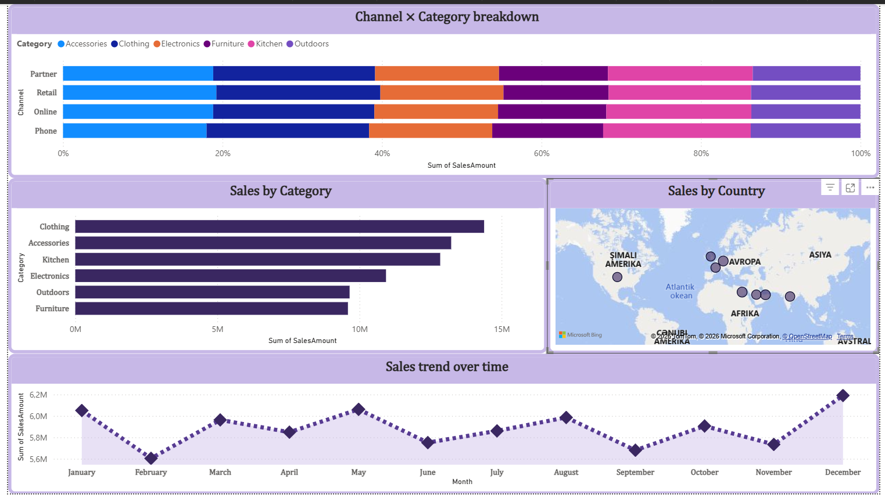

## Chart Selection Strategy

To effectively communicate key insights, four chart types were purposefully chosen:

| Chart Type | Purpose |
|------------|---------|
| Line chart | Display sales trends over time (time series) |
| Horizontal bar chart | Compare performance across categories |
| 100% stacked bar chart | Visualize part-to-whole composition across channel and category dimensions |
| Map | Show geographic distribution at the continent level |

Pie charts were deliberately excluded, as they tend to misrepresent proportions when comparing multiple categories.

