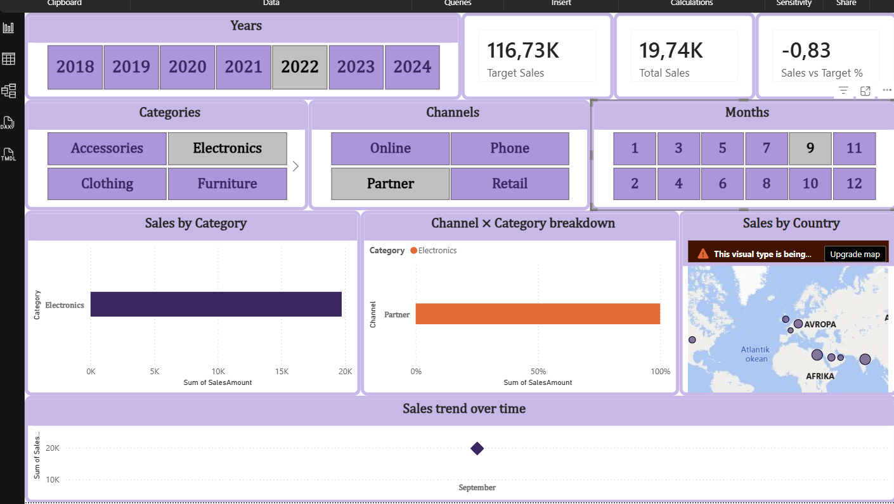

## Checkpoint 4 – KPI Summary Cards

Built 3 KPI cards using DAX measures on `FactSales` and the disconnected `FactSalesTarget` table:

- **Total Sales** = `SUM(FactSales[SalesAmount])`
- **Target Sales** = filters `FactSalesTarget` by selected Year/Month/Category via `SELECTEDVALUE()`, falling back to all categories if none selected
- **Sales vs Target %** = `DIVIDE([Total Sales], [Target Sales]) - 1`

Cards respond dynamically to Year/Month/Category/Channel slicers. A "vs Previous Period" card using `PREVIOUSMONTH()` was attempted but removed 
— the model's date table setup didn't support it reliably within the time available; target comparison covers the KPI requirement instead.

