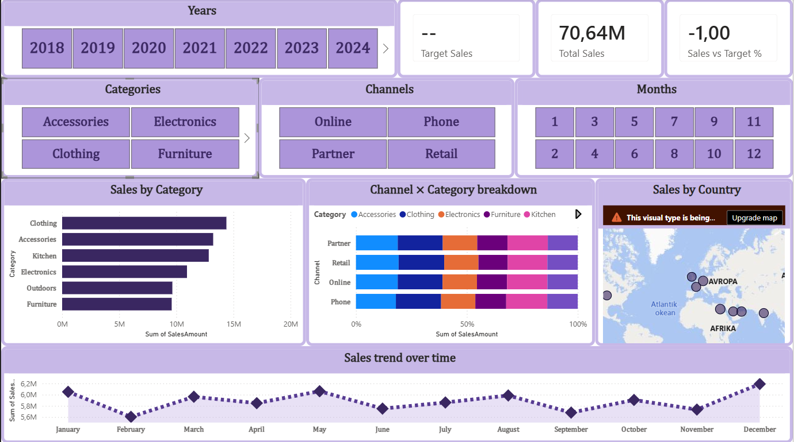

## Dashboard Design

**Visual hierarchy:** KPI cards positioned top for at-a-glance status, slicers grouped directly below for immediate filtering, detail charts (category, channel, 
geography, trend) below that which follows a natural top-to-bottom "summary → filter → detail" reading order.

**Consistent color scheme:** Single purple/lavender palette used across all card headers, slicers, and chart accents for visual cohesion. Category colors kept 
consistent across the stacked bar and category bar chart (same category = same color everywhere).

**Uncluttered:** No pie charts (which avoids the misleading-proportions trap for 6-category data). Each visual has one clear purpose,no visual answers more than one  question at once. Slicers are grouped together rather than scattered, keeping the filtering controls visually distinct from the analysis area.

* Target Sales and Sales vs Target % KPI cards show results only when year, month and categories are chosen.

